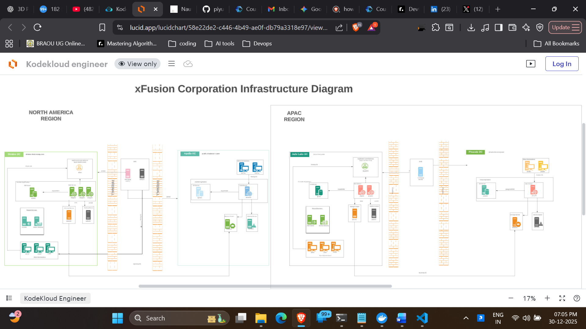

# 🛡️ 100 Days of DevOps - Day 01
## Project: User Management & Security Hardening (Project Nautilus)

## 🏢 Scenario: xFusionCorp Industries
For this challenge, I am acting as a **System Administrator** for **xFusionCorp**, a global company managing a complex infrastructure known as **Project Nautilus**. 

Project Nautilus is a naval subdivision that requires high-security environments for their procurement application. The infrastructure is hosted in the **Stratos Datacenter**, and as part of the DevOps team, my responsibility is to manage servers, automate tasks, and ensure the environment is hardened against unauthorized access.

### 🏗️ Infrastructure Architecture
The Project Nautilus ecosystem consists of several specialized servers:

| Server Name | Hostname | Purpose |
| :--- | :--- | :--- |
| **Jump Host** | `thor` | The entry point for all administrative tasks. |
| **App Server 1** | `stapp01` | Hosts the primary application logic. |
| **App Server 2** | `stapp02` | Redundant application server for high availability. |
| **App Server 3** | `stapp03` | Redundant application server for high availability. |
| **DB Server** | `stdb01` | Manages the application database. |
| **Storage Server** | `ststor01` | Centralized NFS storage for all servers. |

---

### 🖼️ Infrastructure Diagram
  

---

## 🚀 Day 01 Task: Restricted User Creation
**Objective:** Create a service user named `kareem` with a **non-interactive shell** on **App Server 1**.

### 💡 What I Learnt Today
1. **Shell Environments:** I learned the difference between an **Interactive Shell** (allows human login and command execution) and a **Non-Interactive Shell** (used for background services).
2. **Security Hardening:** By assigning `/sbin/nologin`, we ensure that even if the user `kareem` is compromised, an attacker cannot gain a command-line prompt. This is a core part of the **Principle of Least Privilege**.
3. **Environment Navigation:** Practiced moving from the Jump Host to specific application servers using SSH.

### 🛠️ Execution Steps
I performed the following steps to complete the task:

1. **Accessing the Server:**
   ```bash
   ssh tony@stapp01
   ```
2. **Identifying the Environment:**
    ```bash
    hostname
    ```
    **Output confirmed: stapp01**
3. **Creating the User with Restricted Shell:**
    ```bash
    sudo useradd -s /sbin/nologin kareem
    ```
4. **Verifying the Result:**
    ```bash
    grep kareem /etc/passwd
    ```
### ⚠️ Challenges & Troubleshooting

| Challenge Encountered | Root Cause | Resolution |
| :--- | :--- | :--- |
| **Locating App Server 1** | The task mentioned "App Server 1" but terminal labels are hostnames. | Used `hostname` and IP checks to confirm `stapp01` is the correct target. |
| **Permission Denied** | Standard user accounts cannot modify `/etc/passwd`. | Used `sudo` to gain administrative privileges for the `useradd` command. |
| **Choosing the right Shell** | Uncertainty between `/bin/false` and `/sbin/nologin`. | Chose `/sbin/nologin` because it provides a clear "Account not available" message, aiding future troubleshooting. |

#### **Troubleshooting Workflow:**
1. **Validation:** Before executing, I used `hostname` to ensure I was on the correct node in the Stratos Datacenter.
2. **Elevation:** When the system blocked the user creation, I realized that `/etc/passwd` requires root access, which I solved by prepending `sudo`.
3. **Verification:** After the command, I ran `tail -n 1 /etc/passwd` to confirm the user was created with the specific non-interactive shell requested.

---

## 🏁 Conclusion
Day 01 was a successful introduction to the **xFusionCorp** environment. I have learned that system administration is not merely about running commands, but about deeply understanding the **security implications** of every user account created on a production server. 

By implementing non-interactive shells, I've taken the first step toward securing the **Project Nautilus** infrastructure against unauthorized access.

---

### 🔗 Useful Resources
* [Understanding Linux Shells](https://www.gnu.org/software/bash/manual/html_node/Interactive-Shells.html)
* [The Principle of Least Privilege](https://en.wikipedia.org/wiki/Principle_of_least_privilege)
* [xFusionCorp Infrastructure Overview](./architecture-diagram.png)

---
*This project is part of my #100DaysOfDevOps journey. Follow along for daily updates!*